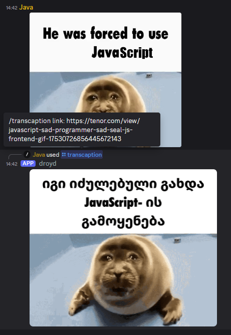
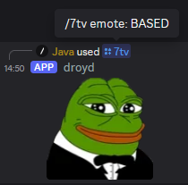
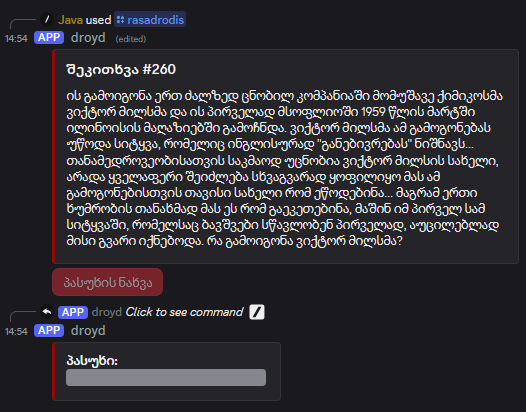
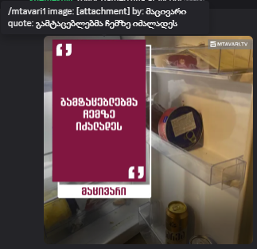
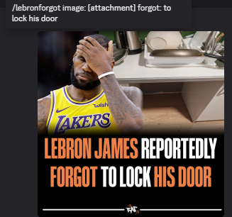

## a 4fun discord bot made with [discord.js](https://discord.js.org/)

## features:

> ## translating a captioned gif or an image

- image processing with [Sharp](https://sharp.pixelplumbing.com/)
- OCR with [Tesseract.js](https://tesseract.projectnaptha.com/)
- translation via Google Translate API

> ## [7tv](https://7tv.app/) integration to send any emote on discord

- using 7TV's [GraphQL](https://graphql.org/) API

> ## random "რა? სად? როდის?" question

- web scraping from [moazrovne.net](http://moazrovne.net/)

>## many other miscellaneous image manupulation commands
- create memes from predefined templates
- mass produce parody news channel social media posts _& more_

examples:

